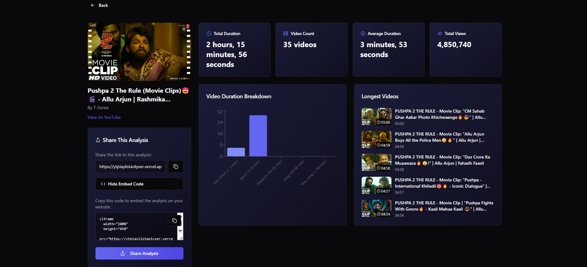

# 📺 YouTube Playlist Analyzer

> Analyze any YouTube playlist in seconds — get total length, detailed stats, shareable results, and even embeddable insights.

 <!-- Replace with actual link -->

---

## 🚀 Live Demo

🔗 [Visit the Live App](https://ytplaylistanlyser.vercel.app)

---

## 🧠 About the Project

This is a **YouTube Playlist Analyzer** that allows users to:

- 🔍 Analyze the **total duration** of any playlist  
- 📄 Get **detailed breakdowns** of videos (title, duration, etc.)  
- 📤 **Share or embed** results easily  
- 📊 Visualize data with beautiful charts  
- 💡 Ideal for **students**, **content curators**, and **analysts**  

---

## 🛠️ Built With

- ⚡️ [Vite](https://vitejs.dev/) + React (TypeScript)  
- 🎨 Tailwind CSS + [ShadCN UI](https://ui.shadcn.dev/) + Radix UI  
- 🔄 [TanStack Query](https://tanstack.com/query/latest) for API state  
- 📊 [Recharts](https://recharts.org/en-US/) for visualizations  
- 🧙‍♂️ Zod for validation  
- 🧑‍🎓 React Hook Form for form handling  
- 🌗 Dark Mode via `next-themes`  
- 📁 [Embla Carousel](https://www.embla-carousel.com/)  
- 🎛️ Radix UI (dialogs, dropdowns, popovers, etc.)

---

## 📸 How It Works
1. Copy playlist link from youtube
2. Pate that URL in input box
3. Press to analyze
4. Now tool see all detail
5. You can share or embed this URL 


---

## 📦 Getting Started

### ✅ Prerequisites

- Node.js (v18+ recommended)  
- Git installed  
- Code editor like VS Code

### 📥 Clone the Repository

```bash
git clone https://github.com/yourusername/yt-playlist-analyzer.git
```
```
cd yt-playlist-analyzer
```
```
npm install
```
```
npm run dev
```

Note:- This is build using vibe coding and my debuging skill.